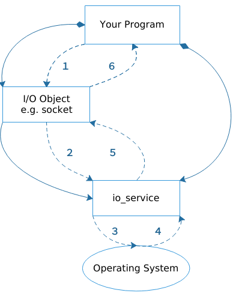

### 1.3 理解同步操作
同步操作就是进行操作系统调用的时候不会立即返回而是持续等待. asio中的异步操作主要包括如下两类:
* 不关注是否耗时的简单程序 或者 相信由操作系统提供的低层超时机制
* 程序需要细粒度的操作系统调用，并且知道同步操作是否会阻塞.

asio可以实现同步和异步的IO对象，比如说`sockets`. 然而同步操作可以提供一个对于各种asio组件一个概念上的介绍，包括和你的程序的协同工作. 让我们来看一个简单的介绍例子，让我们考虑当你需要和一个socket建立同步连接，具体要如何做？
你的程序至少需要一个`io_service`对象，`io_service`服务用来连接你的代码和操作系统低层IO服务.
```
asio::io_service io_service;
```
实现I/O操作，你的代码需要一个I/O对象比如TCP socket：
```
tcp::socket socket(io_service);
```
当进行一个同步连接操作的时候，流程如下：



1. 你的代码通过调用I/O对象初始化了一个连接操作
```
socket.connect(server_endpoint);
```
2. I/O对象发起对`io_service`的请求.
3. `io_service`调用操作系统提供函数发起实际的连接
4. 操作系统返回操作结果给`io_service`服务
5. `io_service`服务把操作回来的错误拼装成`std::error_code`对象中.然后把结果返回给I/O对象
6. 如果操作失败的话，I/O对象就抛出一个系统异常`std::system_error`，如果初始化的操作如下所示，那么操作的结果将会放入到`error_code`而不会抛出异常.
```
std::error_code ec;
socket.connect(server_endpoint, ec);
```
