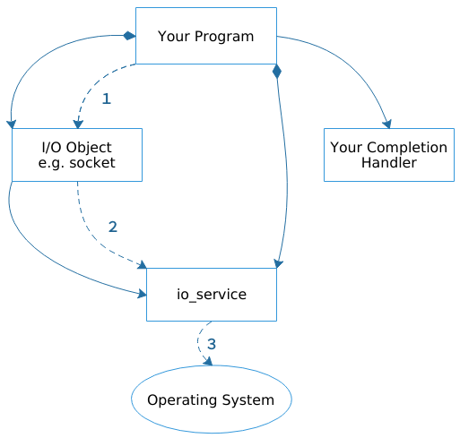

### 2.1 理解异步操作

异步操作不会阻塞调用者，而是在响应的操作完成后调用一个回调由应用注册的回调函数.大多数基于asio的程序都会使用异步操作.
当一个异步操作被使用，流程如下:


1. 你的代码通过调用I/O对象初始化一个异步操作
```
socket.async_connect(
    server_endpoint,
    your_completion_handler);
```
`async_connect()`函数是一个`initiating function`，在asio中`initiating function`都是以`async_`作为前缀，一个`initiating function`需要一个函数对象(回调函数)作为最后一个参数.这种情况下，你的回调函数应该是个函数或者有一个签名的函数对象
```
void your_completion_handler(
    const std::error_code& ec);
```
函数签名依赖具体要做的异步操作. asio的指导手册给出了每个操作正确的格式.

2. I/O对象向`io_service`发起请求
3. `io_service`通知操作系统发起一个异步的连接操作, 在此期间，操作系统接管了应用传递过去的异步操作.
4. 操作系统完成连接操作后把结果放入一个队列中，提供给`io_service`获取
5. 你的程序必须调用`io_service::run()`(或者类似功能的`io_service`成员函数)才能获取结果，如果仍然有任务在运行，那么程序阻塞在`io_service::run()`, 你应该在开始你的异步调用后尽快调用它.
6. 在`io_service:run()`执行时候，io_service到操作队列上获取结果，并转换成`error_code`，然后把它传给回调函数.
