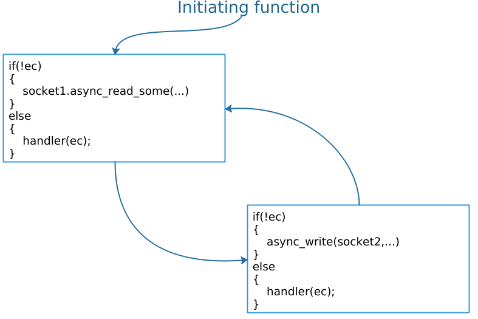

### 7. Passing the buck: developing efficient abstraction

Asio一个关键的设计目标就是支持高层次抽象的创建. 基本的机制就是异步操作的组成. 在Asio的语境里面，我们把它叫做`composed operations`.
作为一个例子，假设有一个用户定义的异步操作，从一个socket读取所有的数据传输到另一个socket,初始化的函数应该做如下声明:
```
template<typename Handler>
void async_transfer(
  tcp::socket &socket1, tcp::socket &socket2,
  std::array<unsigned char, 1024> &working_buffer,
  Handler handler);
```
这个函数可以按照下面两个异步操作来实现: 从socket1读取数据然后写入socket2中.这些操作都是通过中间的回调函数完成,他们的关系按照下图来表示.


>
These  intermediate  completion  handlers  can  “pass  the  buck”  by  customising  the  allocation  and
invocation   hooks   to   simply   call   the   user’s  completion   handler’s   hooks.   In   this   way,   the
composition  has deferred  all  choices on memory allocation  and synchronisation  to the  user  of the
abstraction. The  user  of the  abstraction  gets to select the appropriate tradeoff between  ease  of use
and efficiency, and does not need to pay  for  any synchronisation cost if explicit synchronisation  is
not required（TODO）.

Asio提供了一系列随手可用的这种操作，比如下面几个非成员函数`async_connect()` `async_read()`,`async_write()`和`async_read_until()`. 相关的组合的操作也会在对象`buffered_stream<>`和`ssl::stream<>`中.
